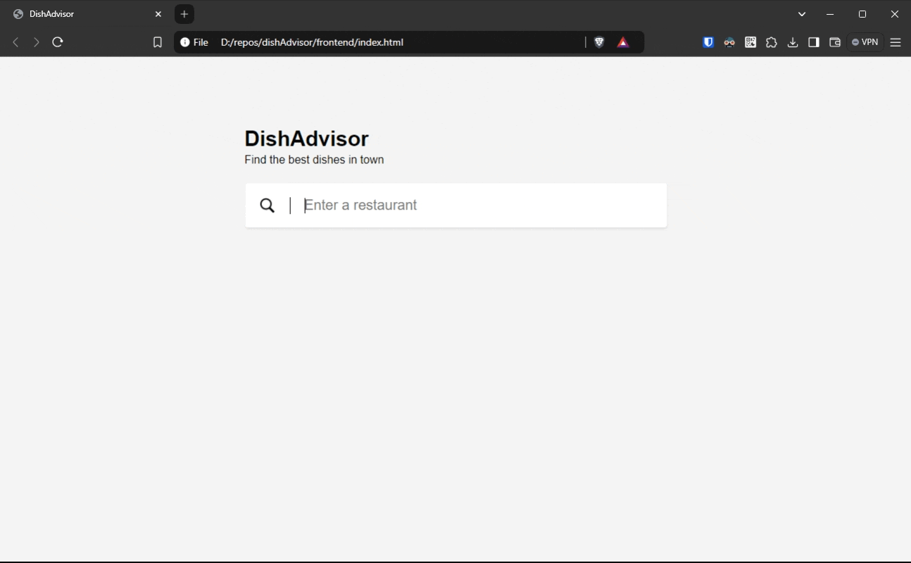

# DishAdvisor

Ever found yourself at an exotic restaurant, unsure of what to order? Or spent too much time scrolling through endless reviews just to pick the perfect dish?

## Overview
The core idea is to help users discover the best dishes based on reviews posted on google maps. This project is a **Prototype** that demonstrates how user feedback can guide diners to the most popular and highly-rated meals.



### Backend
The backend is a Python-based service built with FastAPI that handles API requests, processes reviews, and generates dish recommendations. Currently, for simplification, it uses the API from OpenAI to process the reviews, but we could use an open-source LLM like LLaMA 3.1.

### Frontend
The frontend is a simple HTML/CSS/JavaScript application that interacts with the backend service and Google Maps API.

- **HTML**: The main HTML file is [frontend/index.html](frontend/index.html).

- **JavaScript**: The main JavaScript file is [frontend/script.js](frontend/script.js).

## Setup and Installation
### Backend
1. **Install Dependencies**:
    ```sh
    pip install -r backend/requirements.txt
    ```

2. **Environment Variables**:
    - Copy [`.env.sample`](backend/.env.sample) to [`.env`](backend/.env) and fill in the required values.

3. **Run the Backend**:
    ```sh
    cd backend
    uvicorn src.main:app --reload
    ```

### Frontend
1. **Open `index.html`** in a web browser.

## Usage
1. **Search for a Restaurant**: Use the search bar to find a restaurant.
2. **View Recommendations**: The application will display dish recommendations based on the reviews.

### Note
The reviews obtained by Google Maps are **currently limited to 5**. However, we could use the library [`outscraper`](https://github.com/outscraper/outscraper-python/blob/master/examples/Google%20Maps%20Reviews.md) to scrape more reviews of a restaurant to provide more accurate recommendations.


## Contributing
This project is open source, and any type of refactor or improvement is welcome.

## License
This project is licensed under the MIT License.